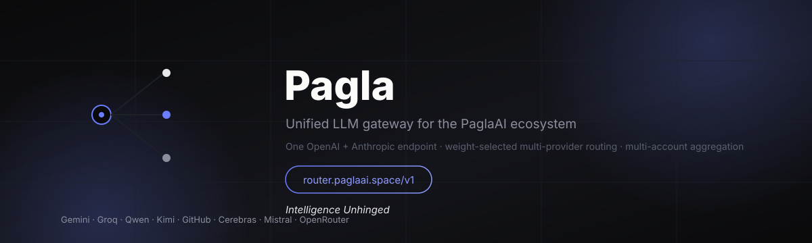
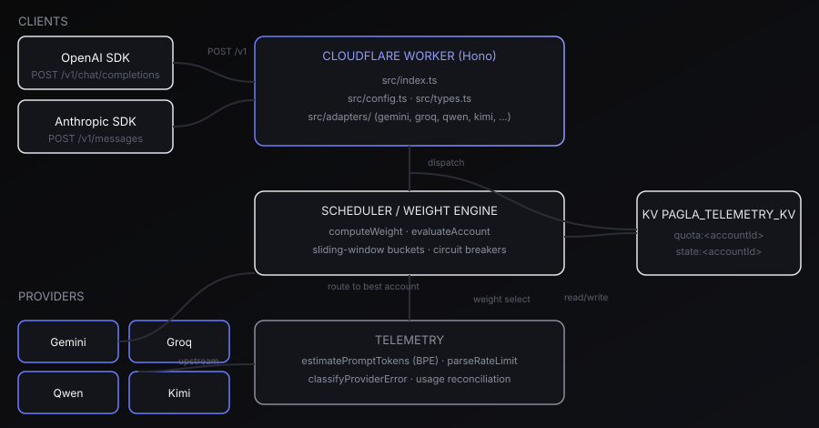

<div align="center">

# PaglaROUTER

[](README.md)

# *Intelligence Unhinged*

**One endpoint. Every provider. Zero waste.**

> “We believe intelligence should flow freely between providers — not be locked
> into one vendor's quota.”

— *PaglaAI Router Team*

[](LICENSE)
[](CHANGELOG.md)
[](https://paglagpt.github.io/PaglaROUTER/)
[](https://github.com/paglagpt/PaglaROUTER/actions/workflows/ci.yml)
[](Tests/)
[](https://workers.cloudflare.com)
[](https://router.paglaai.space)

</div>

## What is PaglaROUTER?

PaglaROUTER is a **stateless Cloudflare Worker** that turns every AI account
you own into a single, always-available endpoint. It presents one OpenAI
(`/v1/chat/completions`) and Anthropic Claude (`/v1/messages`) interface while
dynamically aggregating multi-account credentials, enforcing sliding-window
rate limits, and routing each request across a weighted multi-tier cascade.

If one provider is down, rate-limited, or out of quota, the router silently
fails over to the next best account — your agents never notice.

## Quickstart

```bash
npm install
cp .dev.vars.example .dev.vars     # fill in provider keys
npm run typecheck
npm run dev                        # wrangler dev, local KV emulation

npx wrangler deploy --env production   # ship to the edge
```

```bash
curl https://router.paglaai.space/v1/chat/completions \
  -H "Content-Type: application/json" \
  -d '{ "model": "gemini-2.5-flash",
        "messages": [{ "role": "user", "content": "hi" }] }'
```

## Features

### Routing & failover
- **Weighted cascade selection** — each account is scored per request and the
  best candidate wins; failures cascade to the next.
- **Health + circuit breakers** — permanent lockout on bad keys, exponential
  backoff after repeated 5xx, quarantine on `429`.
- **Concurrency-aware** — in-flight request count cools hot accounts.

### Multi-account aggregation
- **Comma-separate keys** (`GEMINI_API_KEY=key1,key2`) to pool quotas into
  weighted accounts per provider.
- **Alias-tolerant** — `*_API_KEYS` (claude-code-proxy / uni-api convention)
  falls back read-only when the canonical `*_API_KEY` is unset.
- **8 providers out of the box** — Gemini, Groq, Qwen, Kimi, GitHub Models,
  Cerebras, Mistral, OpenRouter.

### Rate-limit bookkeeping
- **Sliding-window token buckets** backed by KV (`quota:<accountId>`), with a
  per-isolate cache; swap for Redis if you need cross-isolate consistency.
- **Live reconciliation** — `x-ratelimit-*` response headers re-sync the local
  counters with the true upstream allowance.
- **Edge token estimation** — a BPE approximation that tracks CJK/word density
  for quota accounting without a cold-start model load.

### Interop & observability
- **Dual protocol** — OpenAI and Anthropic request/response shapes on one base
  URL (`router.paglaai.space/v1`).
- **Shared error taxonomy** — `classifyProviderError` mirrors the PaglaAI
  onboarding wizard (`paglaai_onboard.py`), keeping both in sync.

## Architecture

```
CLIENTS ─────────────────────────── WORKER (Hono)
  OpenAI SDK ──┐                     ┌──────── src/index.ts ──────────┐
  Anthropic SDK ─┤  POST /v1 ────────►│ src/config.ts · src/types.ts    │
                │                     │ src/adapters/ (gemini, groq,    │
                │                     │   qwen, kimi, openai-generic)   │
                │                     └───────────────┬─────────────────┘
                │                     SCHEDULER        ▼  dispatch + telemetry
                │                     ┌────────────────────────────────┐
                │                     │ computeWeight · evaluateAccount │
                │                     │ sliding-window · circuit breaks │
                │                     └───────┬──────────────┬──────────┘
                │                       read/write      route to best
                │                             ▼              ▼
                │                     KV PAGLA_TELEMETRY_KV     PROVIDERS
                │                     quota:<id> · state:<id>    Gemini · Groq ·
                ▼                                                   Qwen · Kimi ·
   router.paglaai.space/v1                                           GitHub · …
```



## Selection Weight

```
W(Ai, M) = H(Ai) · S(Ai) · ( α·Rrpm/Lrpm + β·Rtpm/Ltpm + γ·Rrpd/Lrpd ) · 1/(1+C(Ai))
```

| Symbol | Meaning |
| ------ | ------- |
| `H` | Health factor; `0` = permanent lockout (401/403) |
| `S` | Circuit breaker; `0` = tripped after >3 consecutive 5xx failures |
| `R/L` | Remaining vs. limit for rpm / tpm / rpd in the sliding window |
| `C` | Concurrent in-flight requests |
| `α, β, γ` | Priority coefficients, default `0.3 / 0.4 / 0.3` (sum = 1.0) |

Accounts with `W = 0` are excluded. The account with the highest weight is
dispatched first; failures cascade to the next weighted candidate.

## Error Taxonomy

| Upstream | Router action |
| -------- | ------------- |
| `429` | Parse `Retry-After` / `x-ratelimit-reset`, quarantine account, requeue to next candidate |
| `401` / `403` | Set `H(Ai) = 0` — permanent lockout for that key |
| `400` invalid key / unsupported key type | Classified via `error-classify.ts`; lockout (the key will never work) |
| `500` / `502` / `503` | Increment circuit-breaker counter; trip `S = 0` after >3, jittered backoff |

## Provider Matrix

| Provider | Credential | Quota window | Reset |
| -------- | ---------- | ------------ | ----- |
| Google Gemini | `GEMINI_API_KEY` | 10 RPM · 250k TPM · 500 RPD | Pacific midnight |
| Groq | `GROQ_API_KEY` | 30 RPM · 20k TPM · 14.4k RPD | Rolling |
| Alibaba DashScope | `QWEN_API_KEY` | 60 RPM · 100k TPM | CST midnight |
| Moonshot Kimi | `KIMI_API_KEY` | 15 RPM · 60k TPM | Rolling |
| GitHub Models | `GITHUB_TOKEN` | 10 RPM · 8k ctx · 100 RPD | Rolling |
| Cerebras | `CEREBRAS_API_KEY` | 10 RPM · 30k TPM · 1M TPD | UTC midnight |
| Mistral | `MISTRAL_API_KEY` | 10 RPM · 20k TPM | Rolling |
| OpenRouter | `OPENROUTER_API_KEY` | 20 RPM · 50k TPM | Rolling |

Comma-separate keys inside one credential to aggregate multiple accounts
(`GEMINI_API_KEY=key1,key2` → two weighted Google accounts). The `*_API_KEYS`
alias (claude-code-proxy / uni-api convention) is also accepted read-only:
`GEMINI_API_KEYS` falls back when `GEMINI_API_KEY` is unset.

## Onboarding & key conventions

Run the PaglaAI onboarding wizard (Python, repo root) to add and live-validate
keys, tag them per account (`GEMINI_API_KEY=k1,k2` + `.env.accounts` email map),
and initialize `.paglaai_state.json`:

```bash
python paglaai_onboard.py check            # pre-flight report
python paglaai_onboard.py wizard           # guided multi-key setup
python paglaai_onboard.py check --report out.md
```

Key-type warning: Google rejects unrestricted "standard" Gemini keys since
Jun 19 2026 (all Standard keys ~Sept 2026). The router classifies these as
`unsupported_key_type` (see `src/telemetry/error-classify.ts`, mirrored in the
wizard) and locks the account out rather than retrying it.

## Development

### Tests

```bash
npm test                 # vitest suite under Tests/
```

```bash
npm run typecheck        # strict TS
npm run build            # wrangler deploy --dry-run --outdir dist
```

### Deploy

```bash
npx wrangler deploy --env production
```

Set Worker secrets first (each may hold comma-separated multi-account keys):

```bash
npx wrangler secret put GEMINI_API_KEY --env production
npx wrangler secret put GROQ_API_KEY --env production
# ... QWEN_API_KEY, KIMI_API_KEY, GITHUB_TOKEN, CEREBRAS_API_KEY, MISTRAL_API_KEY, OPENROUTER_API_KEY
npx wrangler secret put ROUTER_ADMIN_TOKEN --env production   # optional auth
```

> `wrangler.toml` references KV id `a1b2c3d4e5f6_pagla_kv`. Create the real
> namespace and paste its id:
> `npx wrangler kv namespace create PAGLA_TELEMETRY_KV`

Once `paglaai.space` NameServers propagate, `https://router.paglaai.space/v1`
activates automatically via the custom-domain route.

## Usage

OpenAI-compatible:

```
POST https://router.paglaai.space/v1/chat/completions
{ "model": "gemini-2.5-flash", "messages": [{ "role": "user", "content": "hi" }] }
```

Anthropic-compatible:

```
POST https://router.paglaai.space/v1/messages
{ "model": "gemini-2.5-flash", "max_tokens": 256, "messages": [{ "role": "user", "content": "hi" }] }
```

## Documentation

- Live docs site — [paglagpt.github.io/PaglaROUTER](https://paglagpt.github.io/PaglaROUTER/)
  (Jekyll build from [`docs/`](docs/))
- Project planning & execution — [TASK_PLAN.md](TASK_PLAN.md)
- Getting involved — [CONTRIBUTING.md](CONTRIBUTING.md) · [CODE_OF_CONDUCT.md](CODE_OF_CONDUCT.md)
- Security policy — [SECURITY.md](SECURITY.md)
- Release history — [CHANGELOG.md](CHANGELOG.md)

## Community & support

- Contact — [paglaai@aynnaghor.space](mailto:paglaai@aynnaghor.space)
- Organization — [github.com/paglagpt](https://github.com/paglagpt)

## License

Distributed under the **MIT License**. See [LICENSE](LICENSE) for more
information. © 2026 PaglaAI · *Intelligence Unhinged*.

---

<div align="center">

PaglaROUTER · built for the [PaglaAI](https://github.com/paglagpt) ecosystem

</div>
