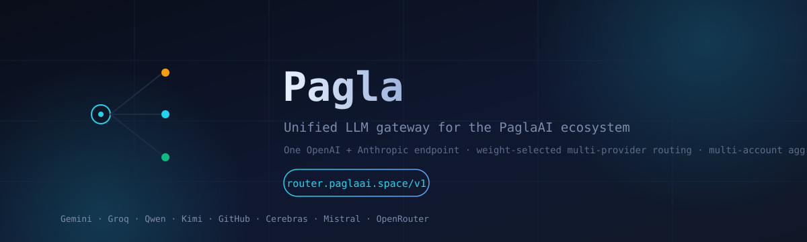

# PaglaROUTER Docs

**One endpoint. Every provider. Zero waste.**

## Sections

| Guide | What it covers |
| ----- | -------------- |
| [Quickstart](quickstart.md) | Run the router locally and hit it in 5 minutes |
| [Architecture](architecture.md) | Worker, scheduler, telemetry, and KV layout |
| [Routing & weighting](routing.md) | `W(Ai, M)`, cascades, and failover semantics |
| [Error taxonomy](error-taxonomy.md) | How upstream failures map to router actions |
| [Providers](providers.md) | Quota matrix and multi-account aggregation |
| [Development](development.md) | Tests, typecheck, build, and deploy |

The full surface (selection weight, error taxonomy, provider matrix) also lives
in the root [README](../README.md). Source-of-truth modules are under
[`src/`](../src).

## Feature map

- **Routing & failover** — weighted cascade selection, health + circuit
  breakers, concurrency-aware cooling.
- **Multi-account aggregation** — comma-separated keys pooled per provider,
  `*_API_KEYS` alias fallback, 8 providers out of the box.
- **Rate-limit bookkeeping** — KV sliding-window buckets, live
  `x-ratelimit-*` reconciliation, edge BPE token estimation.
- **Interop & observability** — dual OpenAI + Anthropic protocol, shared error
  taxonomy mirrored with the PaglaAI onboarding wizard.
