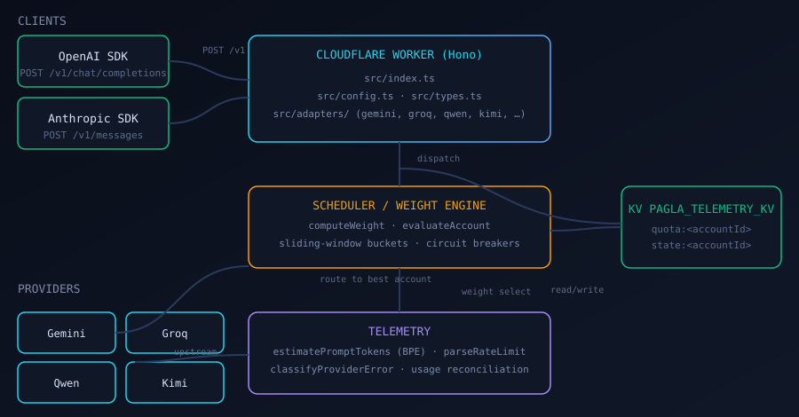

# Architecture



PaglaROUTER is a **stateless Cloudflare Worker** behind one base URL
(`router.paglaai.space/v1`) that speaks both OpenAI and Anthropic protocols.

## Worker entrypoint

`src/index.ts` — a Hono router. It presents `/v1/chat/completions` and
`/v1/messages`, translates each request into a provider-native shape via the
adapters, and funnels responses back through the matching protocol.

`src/config.ts` holds the provider matrix, quota schema, and route resolution.
`src/types.ts` defines the protocol-agnostic request/response types.

## Scheduler

`src/scheduler/` — the decision engine:

- `weight.ts` — `computeWeight` scores an account with
  `W(Ai, M) = H · S · (α·Rrpm/Lrpm + β·Rtpm/Ltpm + γ·Rrpd/Lrpd) · 1/(1+C)`.
- `sliding-window.ts` — KV-backed token buckets plus health/circuit state,
  exposed as `evaluateAccount`, `commitUsage`, `quarantine`, `lockout`,
  `recordFailure`, `resetCircuit`, and in-flight counters.

The scheduler emits an `AccountState` per candidate; the caller dispatches to
the highest-weight account and cascades on failure.

## Adapters

`src/adapters/` — per-provider REST translation:

| Adapter | Providers | Notes |
| ------- | --------- | ----- |
| `gemini.ts` | Google Gemini | Native REST, `x-goog-api-key` |
| `groq.ts` | Groq | OpenAI-compatible passthrough |
| `qwen.ts` | DashScope | `enable_thinking` |
| `kimi.ts` | Moonshot | thinking mode |
| `openai-generic.ts` | GitHub, Cerebras, Mistral, OpenRouter | OpenAI-compatible |

## Telemetry

`src/telemetry/` — observability and reconciliation:

- `bpe.ts` — `estimateTokens` / `estimatePromptTokens`: a BPE approximation
  weighting CJK characters, words, and dense punctuation, cheap enough for a
  cold Worker start.
- `header-parser.ts` — reconciles `x-ratelimit-*` headers against local
  counters so the weight engine tracks the true upstream allowance.
- `error-classify.ts` — the shared error taxonomy, kept in sync with the
  PaglaAI onboarding wizard.

## State

`PAGLA_TELEMETRY_KV` (KV binding) stores two key families:

```
quota:<accountId>    # sliding-window bucket (rpm/tpm/rpd usage)
state:<accountId>    # health factor, circuit failures, quarantine
```

The scheduler keeps a per-isolate in-memory cache for read coalescing. For
multi-isolate consistency the same key schema can back a Redis (Upstash)
implementation instead.

## Edge cases

- **Cold start** — token estimation avoids any model load; state is lazy
  (`freshBucket`) until first use.
- **Corruption** — unparseable KV entries fall back to a fresh bucket/state.
- **Clock** — daily window boundaries (`rolling`, `utc-midnight`,
  `pacific-midnight`, `cst-midnight`) are computed TZ-independently via Intl.
